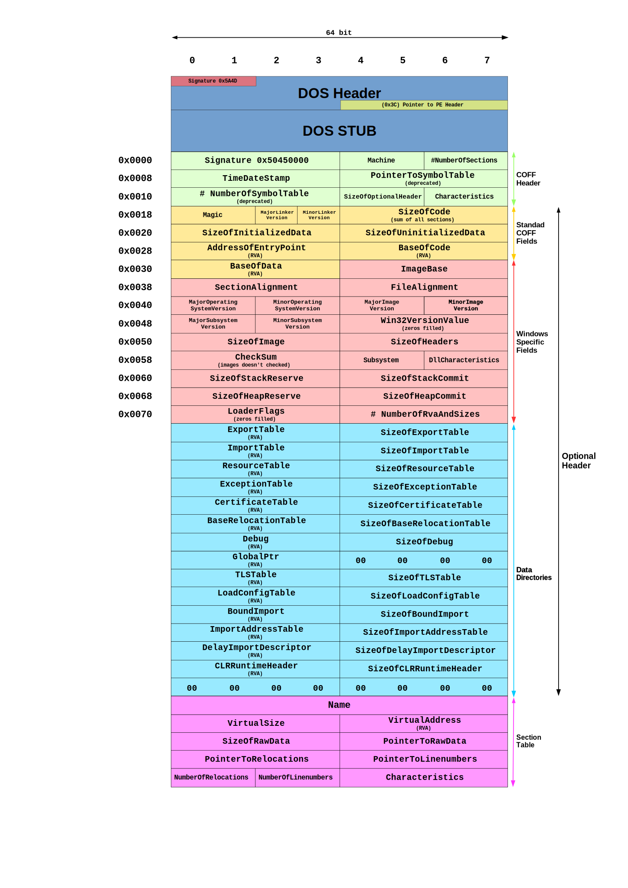

+++
title = "PE 포맷 파일 구조"
date = "2025-06-08"

[taxonomies]
tags = ["os", "windows"]
+++

## PE 포맷이란
PE 포맷은 **Portable Excutable**의 약자로 윈도우 운영체제에서 실행 가능한 파일을 위한 포맷 형식이다. 시그니처는 `MZ`. (MS-DOS의 개발자인 마크 즈비코프스키의 이름을 땄다.)

### 파일 종류
- 실행: `.exe, .scr`
- 드라이버: `.sys, .vxd`
- 라이브러리: `.dll, .ocx, .cpl, .drv`
- 오브젝트: `.obj`

`.scr` 확장자는 생소해서 찾아봤더니 스크린 보호기 파일이라고 한다. 실행 가능하게 만들어지고, 생소해서 악성 코드로 많이 사용된다고 한다.

### PE 포맷 파일 구조
윈도우는 NT 3.1 이후로 PE 포맷으로 확장적으로 옮겼다고 한다. 그래서 PE 파일은 명시적으로 DOS 환경을 지원한다. 다만, 실제로 빌드된 파일을 DOS 환경에서 실행하면 `This program cannot be run in DOS mode` 라는 메시지를 보여준다. 단순히 호환성만 유지..



위 사진을 바탕으로, 크게 구조를 헤더와 바디로 나눌 수 있다. 헤더에는 DOS Header와 DOS Stub이 있고, 바디에는 이 헤더에 정의된 섹션들이 있다.

이렇게 구조화된 이유는, 프로세스 동적 링커에게 파일을 어떻게 메모리로 매핑할 지 설명할 수 있게 하기 위해서다.

각 세션별로 OS에게 요구하는 권한이 다르다. 예를 들어, 코드 섹션(대표적으로 `.text`)은 읽기 권한이 필요하고, 데이터 섹션(대표적으로 `.data`)은 읽기/쓰기 권한이 필요하다.

#### 세션 정렬
디스크와 메모리에서 요구하는 정렬 방식이 다른데, 이는 목적성이 다르기 때문이다.

메모리에서 섹션은 페이지 단위(일반적으로 4kb)로 정렬되어야 한다. 이러한 이유는 메모리 효율성에서 찾아볼 수 있다. 페이지 섹션의 크기가 작으면 **페이지 테이블**이 커지고, (여러 페이지의 권한 정보를 모두 리스트업 해야하니) 페이지 섹션의 크기가 크면 **낭비되는 공간**이 커진다.

즉, 디스크에서 사용하는 `FlieAlignment`와 `SectionAlignment`가 다른 이유가 이것이다. 디스크에 있는 그대로 정렬하면 메모리 효율성이 떨어지기 때문에.

반대로도 똑같다. 메모리에 4kb로 저장하던 걸 디스크에 그대로 빼다박으면 낭비되는 공간이 커진다.

### DOS Header
앞서 설명한 내용이 도스 헤더에 반영되어 있기에 길게 설명할 건 없고, 구조체로 직접 살펴보자.

```rust
struct DOSHeader {
    e_magic: u16,      // 매직 넘버: 항상 'MZ'(0x5A4D) 값을 가집니다. DOS 실행 파일임을 나타냅니다.
    e_cblp: u16,       // 파일의 마지막 페이지에 있는 바이트 수
    e_cp: u16,         // 파일에 있는 페이지 수
    e_crlc: u16,       // 재배치(Relocation) 수
    e_cparhdr: u16,    // 단락(paragraph) 단위의 헤더 크기 (1 단락 = 16 바이트)
    e_minalloc: u16,   // 프로그램을 실행하기 위해 필요한 최소 추가 단락 수
    e_maxalloc: u16,   // 프로그램을 실행하기 위해 필요한 최대 추가 단락 수
    e_ss: u16,         // 초기 스택 세그먼트(SS) 레지스터 값
    e_sp: u16,         // 초기 스택 포인터(SP) 레지스터 값
    e_csum: u16,       // 체크섬
    e_ip: u16,         // 초기 명령어 포인터(IP) 레지스터 값
    e_cs: u16,         // 초기 코드 세그먼트(CS) 레지스터 값
    e_lfarlc: u16,     // 재배치 테이블의 파일 주소
    e_ovno: u16,       // 오버레이 번호
    e_res: [u16; 4],   // 예약된 공간
    e_oemid: u16,      // OEM 식별자
    e_oeminfo: u16,    // OEM 정보
    e_res2: [u16; 10], // 예약된 공간
    e_lfanew: u32,     // PE 헤더(NT 헤더)의 파일 오프셋. 가장 중요한 필드입니다.
}
```

일반적으로 현대 NT에서는 쓸모없는 정보들이다. 과거 호환성만 남겨놓으려고 만들어진 것이기 때문에 훑고 넘어가도 괜찮다. e_lfanew 필드가 중요한데, 이는 PE 헤더(NT 헤더)의 파일 오프셋을 가리킨다.

### DOS Stub
현대 NT 헤더 다음에 있는 영역인데, 따로 중요한 부분은 아니다. DOS 환경에서 실행되는 파일이라면 이 영역에 있는 코드가 실행된다.

### NT Header

NT 헤더 구조체는 1개의 시그니처 필드와 2개의 하위 구조체로 이루어져 있다. 시그니처 필드는 항상 `PE\0\0` 값을 가진다.

```rust
struct NTHeader {
    signature: u32,                      // 시그니처: 항상 'PE\0\0' (0x50450000) 값을 가집니다.
    file_header: FileHeader,             // 파일의 물리적 레이아웃과 속성에 대한 정보
    optional_header: OptionalHeader,     // 파일의 논리적 실행에 필요한 정보 (이름과 달리 필수)
}

struct FileHeader {
    machine: u16,                // 대상 CPU 아키텍처 (e.g., 0x8664 for x64, 0x14c for x86), WinNT.h에 정의된 값
    number_of_sections: u16,     // 섹션 헤더 테이블에 있는 섹션의 수
    time_date_stamp: u32,        // 파일이 생성된 시간 (Unix timestamp)
    pointer_to_symbol_table: u32,// COFF 심볼 테이블의 파일 오프셋 (디버깅용, 보통 0)
    number_of_symbols: u32,      // COFF 심볼 테이블의 심볼 수
    size_of_optional_header: u16,// 바로 뒤에 오는 OptionalHeader의 크기
    characteristics: u16,        // 파일의 속성을 나타내는 플래그 (e.g., 실행 가능한지, DLL인지, 커널인지 ...)
}

// 32비트 PE 파일(PE32) 기준의 OptionalHeader
struct OptionalHeader {
    // --- Standard COFF Fields ---
    magic: u16,                          // 매직 넘버: 0x10b (32-bit), 0x20b (64-bit)
    major_linker_version: u8,            // 링커의 메이저 버전
    minor_linker_version: u8,            // 링커의 마이너 버전
    size_of_code: u32,                   // 모든 코드 섹션(.text)의 총 크기
    size_of_initialized_data: u32,       // 초기화된 데이터 섹션들의 총 크기
    size_of_uninitialized_data: u32,     // 초기화되지 않은 데이터 섹션(.bss)들의 총 크기
    address_of_entry_point: u32,         // 프로그램 실행 시작 주소 (RVA: Relative Virtual Address)
    base_of_code: u32,                   // 첫번째 코드 섹션의 시작 RVA
    base_of_data: u32,                   // 첫번째 데이터 섹션의 시작 RVA (64-bit에서는 이 필드가 없음)

    // --- Windows-specific Fields ---
    image_base: u32,                     // 메모리에 로드될 때의 권장 시작 가상 주소
    section_alignment: u32,              // 메모리에서의 섹션 정렬 단위 (보통 4KB)
    file_alignment: u32,                 // 파일에서의 섹션 정렬 단위 (보통 512 바이트)
    major_operating_system_version: u16, // 필요한 운영체제의 메이저 버전
    minor_operating_system_version: u16, // 필요한 운영체제의 마이너 버전
    major_image_version: u16,            // 이미지의 메이저 버전
    minor_image_version: u16,            // 이미지의 마이너 버전
    major_subsystem_version: u16,        // 서브시스템의 메이저 버전
    minor_subsystem_version: u16,        // 서브시스템의 마이너 버전
    win32_version_value: u32,            // 예약된 필드, 항상 0
    size_of_image: u32,                  // 메모리에 로드된 전체 이미지의 크기
    size_of_headers: u32,                // 모든 헤더(DOS, PE, Section)를 합친 크기
    check_sum: u32,                      // 이미지 파일 체크섬 (유효성 검사)
    subsystem: u16,                      // 실행에 필요한 서브시스템 (e.g., GUI, Console)
    dll_characteristics: u16,            // DLL 관련 보안 플래그 (e.g., ASLR, DEP)
    size_of_stack_reserve: u32,          // 처음에 예약할 스택의 크기
    size_of_stack_commit: u32,           // 처음에 실제로 할당(커밋)할 스택의 크기
    size_of_heap_reserve: u32,           // 처음에 예약할 힙의 크기
    size_of_heap_commit: u32,            // 처음에 실제로 할당(커밋)할 힙의 크기
    loader_flags: u32,                   // 예약된 필드, 사용되지 않음
    number_of_rva_and_sizes: u32,        // 아래 DataDirectory 배열의 유효한 항목 수 (보통 16)
    data_directory: [ImageDataDirectory; 16], // 데이터 디렉터리 배열
}

// DataDirectory 배열의 각 항목을 위한 구조체
struct ImageDataDirectory {
    virtual_address: u32, // 데이터의 시작 가상 주소 (RVA)
    size: u32,            // 해당 데이터의 크기 (바이트)
}
```

구조만 봐서는 뭐가 뭔지 모르니, 하나씩 톺아보자.

## 참조
- https://ko.wikipedia.org/wiki/PE_%ED%8F%AC%EB%A7%B7
- https://jeongzero.oopy.io/ea359704-1d23-479f-96b0-ac4014c0cda5