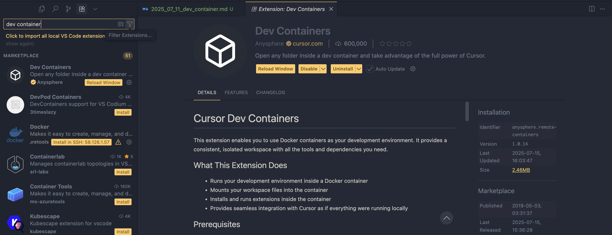

+++
title = "devcontainer 도입기"
date = "2025-07-11"

[taxonomies]
tags = ["devcontainer", "docker"]
+++

## 배경

근래에 회사에서 레거시 프로젝트를 수정하는 업무를 맡았다. 근데 스택이 너무 레거시 스택(자바 1.8, 톰캣, 오라클 11g)이라 초기 환경 설정이 힘들 것 같았다. 호스트에는 JDK 17이 깔려있는데 말이다.

스택은 트레이드오프에 따라 결정할 수 있으니 크게 거슬리는 건 없었는데, 진짜 문제는 기술 부채가 너무 심각했다.
- `Maven`은 예전에 만들다 말았는지 컴파일 불가
- 내부 소스 상태는 컨벤션이라고는 볼 수 없는 코드
- 빌드가 이클립스에 한정적이어서 나머지 IDE에서는 빌드 불가

이 중에서 제일 문제는 **빌드가 이클립스에서만 가능하다는 것**이다.

## 해결
해결책으로 나는 `devcontainer`를 도입했다. 실제로 사원 중에 VSC로 개발하는 인원이 대다수였고, 이클립스를 '제대로' 사용할 줄 아는 분은 없었다. 이때매 디버깅 시간도 오래 걸리고 잔버그로 고생하는 분들이 많았다.

기존 이클립스 IDE와 호환성을 유지하기 위해 다음과 같은 원칙을 준수했다:
- 기존 스택의 버전을 동일하게 사용한다.
- 기존 스택의 설정을 그대로 유지한다.
- IDE 설정을 건드리지 않는다.

## 구성
`devcontainer`를 구성하는 방법에는 일반적으로 두가지가 있다.
- 컨테이너 이미지를 직접 만들어서 사용하는 방법
- 컨테이너 이미지를 사용하는 방법

현재 유즈케이스에서는 따로 현대적인 스택도 아니고 이미지도 적다보니, 컨테이너 이미지를 직접 만드는 방법을 택했다.

우선 컨테이너 이미지를 입히기 전, 환경 구축을 먼저 해보자
프로젝트 루트에 `.devcontainer` 폴더를 만들고, 그 안에 `devcontainer.json` 파일을 만든다.

```
.devcontainer/
├── devcontainer.json
└── Dockerfile
```

아래가 도커 이미지를 직접 만들어 쓰는 방법이고,
```json
{
    "name": "devcontainer",

    // 도커 이미지 빌드 설정 (직접 이미지를 빌드할 때)
    "dockerFile": "Dockerfile",
    "context": ".",

    // 도커 이미지 사용 설정 (이미지가 미리 빌드되어 있을 때)
    "image": "devcontainer/devcontainer:latest",

    // 위 둘 중 택일

    // ------- 추가 설정 -------

    // VSC 설정
    "settings": {
        "terminal.integrated.shell.linux": "/bin/bash",
        "java.home": "/usr/lib/jvm/java-17-openjdk-amd64",
    },

    // VSC 익스텐션 (devcontainer가 연결되면 자동으로 설치됨)
    "extensions": [
        "vscjava.vscode-java-pack",
    ],


    // 컨테이너 내부 포트를 호스트에 포워딩
    "forwardPorts": [8080],

    // 컨테이너 내부 사용자 이름 (기본값은 root)
    "remoteUser": "dev",
}
```

아래가 배포된 이미지를 사용하는 방법이다.
```json
{
    "name": "devcontainer",
    "dockerFile": "Dockerfile",
    "context": ".",

    // ------- 추가 설정 -------

    // VSC 설정

    "image": "devcontainer/devcontainer:latest",
}
```

---


특별한 경우를 제외하고는 **유저의 권한은 `root`로 설정하지 않는 것이 보안에 바람직하다**. 컨테이너 내부에서 `root` 권한으로 실행되는 프로세스가 해킹당할 경우, 호스트 시스템에도 **심각한 보안 위험**이 될 수 있기 때문이다. 따라서 일반적으로는 `remoteUser` 설정을 통해 일반 사용자 권한으로 실행하는 것이 권장된다. (참고: https://code.visualstudio.com/remote/advancedcontainers/add-nonroot-user)

이제 VSC의 확장 프로그램에서 `devcontainer`를 검색하고 받아주자


> 저는 커서이기 때문에 해당 확장 프로그램을 설치함

이제 프로젝트 루트에서 `Ctrl + Shift + P`를 눌러 `Dev Containers: Reopen in Container`를 선택하면 된다.

## 결론
`devcontainer`도 만능은 아니다. 한 프로젝트 당 `GuestOS`를 하나씩 할당하기에 만약 여러 프로젝트를 킨다면 램을 비용이 꽤 든다.

좋은 점은 보안적으로 좋을 것이다. 유저를 제한해두면 해당 컨테이너 내에서 어떤 프로세스를 실행하더라도 호스트 시스템에 영향을 미치지 않는다. (제로데이 취약점이 있을수도 있긴 함)

## 참조
- https://code.visualstudio.com/remote/advancedcontainers/overview